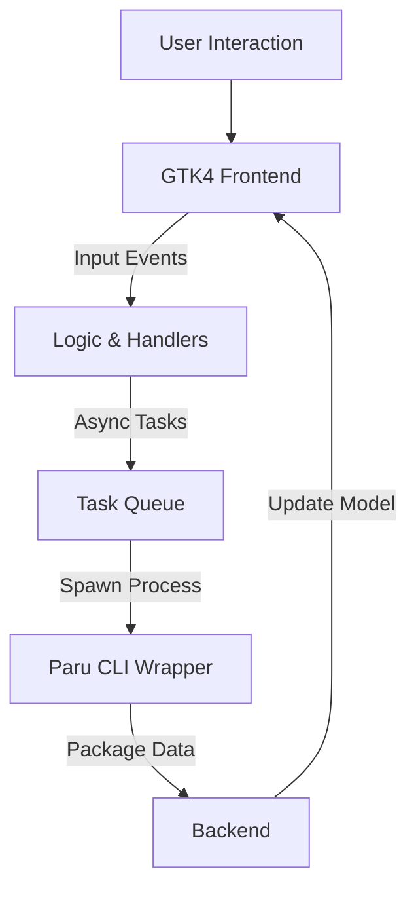

# Welcome to the Parut Wiki

This repository contains the complete documentation for **Parut**, the modern GTK4/Libadwaita frontend for the Paru AUR helper.

---

## 📚 Table of Contents

1.  **[Getting Started](#getting-started)**
    *   [Prerequisites](#prerequisites)
    *   [Installation](#installation)
    *   [Post-Install Setup](#post-install-setup)
2.  **[User Guide](#user-guide)**
    *   [The Dashboard](#the-dashboard)
    *   [Searching Packages](#searching-packages)
    *   [Managing Updates](#managing-updates)
    *   [The Task Queue](#the-task-queue)
    *   [Reviewing PKGBUILDs](#reviewing-pkgbuilds)
3.  **[Architecture & Design](#architecture--design)**
    *   [System Overview](#system-overview)
    *   [Component Breakdown](#component-breakdown)
    *   [Concurrency Model](#concurrency-model)
4.  **[Developer Documentation](#developer-documentation)**
    *   [Building form Source](#building-from-source)
    *   [Project Structure](#project-structure)
    *   [Contribution Guidelines](#contributing)
5.  **[Troubleshooting & FAQ](#troubleshooting--faq)**

---

## Getting Started

### Prerequisites

Parut is designed for Arch Linux and Arch-based distributions. It relies on the following components:

*   **Operating System**: Arch Linux (or derivatives like EndeavourOS, Manjaro)
*   **AUR Helper**: `paru` must be installed and configured.
*   **Desktop Environment**: GNOME 40+ is recommended for the best integration, but Parut works on any DE that supports GTK4.

**System Dependencies:**
```bash
sudo pacman -S gtk4 libadwaita base-devel git
```

### Installation

#### Method 1: Building from Source (Recommended)

1.  Clone the repository:
    ```bash
    git clone https://github.com/parut/parut.git
    cd parut
    ```
2.  Build the release binary:
    ```bash
    cargo build --release
    ```
3.  Run the application:
    ```bash
    ./target/release/parut
    ```

To install system-wide, copy the binary to your path:
```bash
sudo cp target/release/parut /usr/local/bin/
```

### Post-Install Setup

Parut works out-of-the-box. It will detect your `~/.config/paru/paru.conf` if present, but currently relies on its own internal defaults for UI behavior.

**Theming**: Parut automatically respects your system's color scheme (Light/Dark mode) via Libadwaita. No manual configuration is required.

---

## User Guide

### The Dashboard

The Dashboard is your command center. Upon launching Parut, you are greeted with a high-level overview of your system's package status.

*   **Statistics Cards**: Real-time counts of:
    *   Total Installed Packages
    *   Available Updates
    *   Foreign/AUR Packages
*   **Quick Actions**:
    *   **Update System**: Triggers a full system upgrade (`paru -Syu`).
    *   **Clean Cache**: (Coming Soon) Frees up disk space.

### Searching Packages

Parut provides a unified search interface for both official repositories (Core, Extra) and the AUR.

1.  Navigate to the **Search** tab.
2.  Begin typing in the search bar.
3.  **Debouncing**: To prevent lag, Parut waits 300ms after you stop typing before querying the backend.
4.  **Results**: Packages are listed with:
    *   Name and Description
    *   Version (Current vs Installed)
    *   **Repository Badge**: Color-coded badges (Green for Core, Blue for Extra, Orange for AUR) help you identify the source instantly.

### Managing Updates

The **Updates** tab shows a filtered list of all packages with newer versions available.

*   **Update All**: Click the button in the header to queue a full system update.
*   **Individual Update**: (Future Feature) Currently, we recommend performing full system updates to maintain partial upgrades safety.

### The Task Queue

Parut uses a non-blocking background queue for operations. When you click "Install" or "Update":

1.  The action is added to the **Task Queue**.
2.  The UI remains responsive.
3.  You can view the specific progress of current operations by clicking the **Queue** button in the header bar.
4.  The Queue window shows:
    *   Active/Pending Tasks
    *   Status (Running, Completed, Failed)
    *   Real-time output stream from the underlying `paru` process.

### Reviewing PKGBUILDs

Security is paramount when using the AUR. Parut enforces a review workflow:

1.  When you try to install a package from the AUR, a dialog appears.
2.  The dialog fetches and displays the **PKGBUILD** source code.
3.  You **must** review this code for malicious commands.
4.  Only after closing the review dialog or clicking "Install" (after review) will the task proceed.

---

## Architecture & Design

### System Overview

Parut follows a Model-View-Controller (MVC) adaptation for Rust/GTK.



### Component Breakdown

*   **`src/main.rs`**: Entry point. Sets up the `AdwApplication` and loads CSS styles.
*   **`src/ui.rs`**: The heavyweight module containing UI construction logic. It manages the `ViewStack`, creates widgets, and handles signals.
*   **`src/paru.rs`**: The backend adapter. It wraps `std::process::Command` to execute `paru` and parses the stdout into `Vec<Package>` structs.
*   **`src/task_queue.rs`**: A threaded task manager. It uses a `Mutex`-protected queue and a dedicated worker thread to execute package operations sequentially without blocking the UI main loop.

### Concurrency Model

Parut uses a hybrid concurrency model:
1.  **Main Thread**: Handles all GTK event loops and rendering.
2.  **Worker Thread**: The `TaskQueue` spawns a dedicated long-lived thread (`TaskWorker`) that consumes jobs from a channel. This ensures `paru` operations (which can take minutes) never freeze the UI.
3.  **Async/Await**: The UI uses `glib::spawn_future_local` for lightweight parsing tasks or debounced search queries.

---

## Developer Documentation

### Project Structure

```text
parut/
├── Cargo.toml          # Dependencies (gtk4, libadwaita, etc.)
├── build.rs            # Build script
├── src/
│   ├── main.rs         # Application entry
│   ├── ui.rs           # UI Layout & Widget Logic
│   ├── paru.rs         # Paru CLI Wrapper & Parsers
│   ├── task_queue.rs   # Background Job Processor
│   ├── logger.rs       # File Logging
│   └── style.css       # Native Adwaita Styling overrides (Minimal)
└── README.md           # Quick Start
```

### Contributing

We welcome contributions! Please follow these steps:

1.  **Simplicity First**: We aim for a native look. Avoid styling that fights against Libadwaita.
2.  **Safety**: Always validate inputs passed to `paru.rs`.
3.  **Clippy**: Ensure code passes `cargo clippy` without warnings.

**Formatting Code:**
```bash
cargo fmt
```

**Running Tests:**
*(Currently, tests are manual due to the GUI nature of the app, but unit tests for parsers in `paru.rs` are planned).*

---

## Troubleshooting & FAQ

### Frequently Asked Questions

**Q: Why does the search take a moment to start?**
A: We use a 300ms "debounce" timer. This waits for you to finish typing to avoid spamming the backend with queries for every single keystroke.

**Q: Where are the logs?**
A: Logs are stored in `~/.local/share/parut/parut.log` (or `~/.parut/parut.log` on some setups).

**Q: Can I use this for Manjaro/EndeavourOS?**
A: Yes, as long as `paru` is installed.

### Common Issues

**Crash during search (Fixed in v0.2.0)**
*   *Symptoms*: Application aborts with "Source ID not found".
*   *Cause*: A race condition in clearing debounce timers.
*   *Solution*: Update to the latest version `git pull && cargo build --release`.

**Theme looks broken**
*   Ensure you have `libadwaita` installed. Parut relies on the system theme. If you are on a window manager (i3/Sway on non-GNOME), ensure you have `gnome-themes-extra` or configured `GTK_THEME`.

---

*This Wiki is maintained by the Parut community.*
